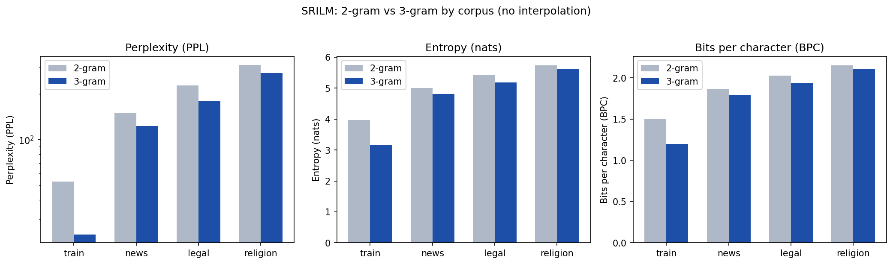
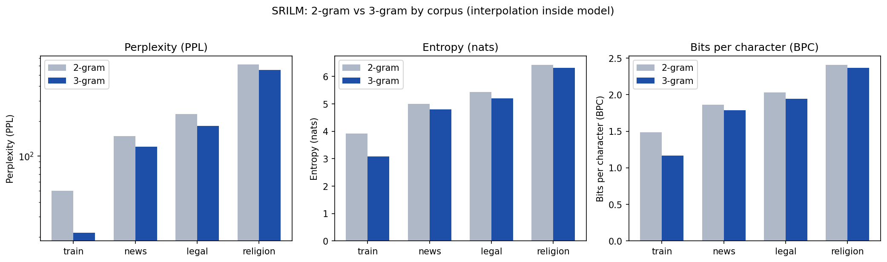
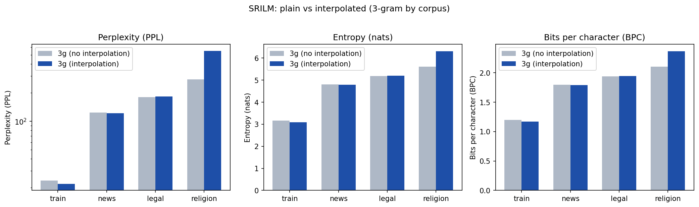
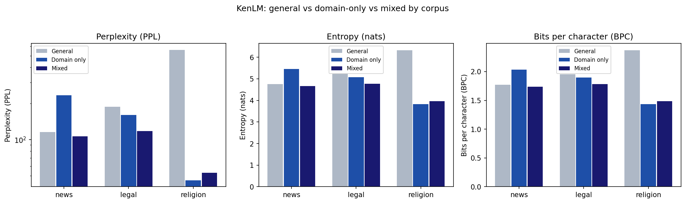

# Cross-Domain Burmese N-gram Language Modeling

## Overview

This project trains Burmese n-gram language models with KenLM and SRILM on a shared corpus, then compares toolkit performance and perplexity across news, legal, and religious test domains to study cross-domain generalization.

---

## Dataset

### Train Data (General LM)
- [Myanmar ALT](https://www2.nict.go.jp/astrec-att/member/mutiyama/ALT/my-alt-190530.zip) from [ALT Treebank Corpus](https://www2.nict.go.jp/astrec-att/member/mutiyama/ALT/)
- [Sayar's myPos version 3.0](https://github.com/ye-kyaw-thu/myPOS/blob/master/corpus-ver-3.0/corpus/mypos-ver.3.0.txt)
- https://huggingface.co/datasets/URajinda/myanmar_spoken_corpus_v4_cleaned (Discarded later due to RAM issue)

### Train Data (Domain-Specific LM) && Test Data

- Custom data in the news article domain (from [BBC Burmese International News](https://www.bbc.com/burmese/topics/cnlv9j1z93wt))
- Custom data in the legal document domain (from [မြန်မာနိုင်ငံကူးလက်မှတ်ဆိုင်ရာဥပဒေ](https://www.moi.gov.mm/file-download/download/public/103555) published by the Myanmar Ministry of Information)
- Custom data in the religious text domain (from [ခန္ဓဝိပဿနာဘာဝနာ](https://18milecdn.myanmarseo.com/file/18mile-cdn/books/%E1%80%81%E1%80%94%E1%80%B9%E1%80%93%E1%80%9D%E1%80%AD%E1%80%95%E1%80%BF%E1%80%94%E1%80%AC%20%E1%80%98%E1%80%AC%E1%80%9D%E1%80%94%E1%80%AC.pdf) by 18 Miles Sayardaw)

## Data Collection & Preprocessing

### Train Data
Training data come from existing corpora: word tags are removed, the sources are merged, then passed through syllable normalization (`syl-normalizer`) and OppaWord segmentation to produce the final train corpus.

In `prep_train_data_v1`, the Hugging Face spoken corpus was included; the merged file exceeded 3 GB and could not be loaded on a machine with limited RAM. `prep_train_data_v2` drops that corpus and uses only the ALT and myPOS datasets.

### Test Data
Test domains were chosen manually, collected by hand, and preprocessed with the same pipeline (punctuation/tag cleaning, syllable normalization, OppaWord). Sentences are split on Burmese full stops (`။`); very short lines (e.g. legal section numbers) are dropped. Remaining syllables are realigned into a fixed grid of 20 syllables per line and 15 lines per document (300 syllables per document), with the same document count across all three domains. The balanced outputs are saved as `*.cleaned.state4`.

---

## Models

### 1a. General KenLM

- **conclusion**: choose 3-gram

### 2a. General SRILM (Kneser-Ney discounting)


- **conclusion**: choose 3-gram


- **conclusion**: choose 3-gram


- **conclusion**: choose interpolation for other domains except `religion`

### 1b. General + Domain-Specific KenLM

- **conclusion**: choose mixed model

### 2b. General + Domain-Specific SRILM (Kneser-Ney discounting)

---

## File Structure
```
/
...
├── data/
│   ├── train/
│   │   └── domain-specific/
│   └── test/
│
├── img/
├── notebooks/
├── models/
├── oppaword/              # originally Sayar's
├── syl-normalizer/        # originally Sayar's
│
├── clean_text.py          # originally Sayar's # modified to remove word tags
├── eval_kenlm_srilm.py    # originally Sayar's eval_kenlm.py # modified to compute BPC and evaluate SRILM
│
├── conda_environment.yaml
└── requirements.txt
```

## File formats

### Language models

- **`.arpa`**: ARPA-format n-gram language model.
- **`.arpa.binary`**, **`.arpa.ken.binary`**: KenLM binary model (from KenLM `build_binary`).
- **`.arpa.bin`**: SRILM binary model (from SRILM `ngram -write-bin-lm`).
- **`.arpa.error`**: stderr when building an ARPA model.

### Evaluation/tuning artifacts

- **`.ppl`**: Perplexity / debugging output for `compute-best-mix` (from SRILM `ngram -ppl`).

### Text corpora

- **`.raw`**: Unprocessed text.
- **`.cleaned.state1`**: After punctuation and word/POS tags removal (`clean_text.py`).
- **`.cleaned.state2`**: After syllable normalization (`syl-normalizer/`).
- **`.cleaned.state3`**: After word segmentation (`oppaword/`); typical line input for training general LMs.
- **`.cleaned.state4`**: Further standardized token layout used for test sets only.

### Train/dev splits

- **`.train`**: In-domain training split for domain-specific LMs.
- **`.dev`**: In-domain development split for tuning interpolation weights.

## Environment Setup

- Install KenLM from https://github.com/kpu/kenlm
- Install SRILM from https://github.com/BitSpeech/SRILM
- Install dependencies from `requirements.txt` or `conda_environment.yaml`

## References

- https://github.com/ye-kyaw-thu/AIE-F/tree/main/slide-code/class-15/LM-Tutorial
- ```bibtex
  @misc{syl_normalizer,
    author       = {Ye Kyaw Thu},
    title        = {{Syllable Normalization Tool for Myanmar Language}},
    version      = {0.6},
    month        = {May},
    year         = {2026},
    publisher    = {GitHub},
    url          = {https://github.com/ye-kyaw-thu/syl-Normalizer/tree/main/ver_0.6},
    note         = {Accessed: YYYY-MM-DD},
    institution  = {Language Understanding Lab (LU Lab), Myanmar}
  }
  ```
- ```bibtex
  @misc{oppaWord_2025,
    author       = {Ye Kyaw Thu},
    title        = {{oppaWord: Hybrid DAG+Bi-MM+LM Myanmar Word Segmenter}},
    version      = {1.0},
    month        = {August},
    year         = {2025},
    publisher    = {GitHub},
    url          = {https://github.com/ye-kyaw-thu/oppaWord},
    note         = {Accessed: YYYY-MM-DD},
    institution  = {Language Understanding Lab (LU Lab), Myanmar}
  }
  ```

## Note

This project was done for educational purposes as an assignment for the AI Engineering Fundamentals class taught by [*Sayar Ye Kyaw Thu*](https://github.com/ye-kyaw-thu).
